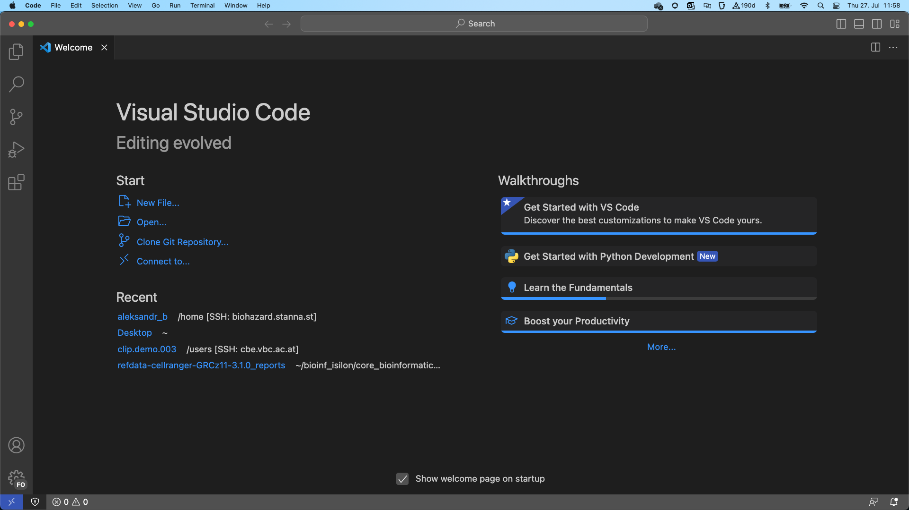
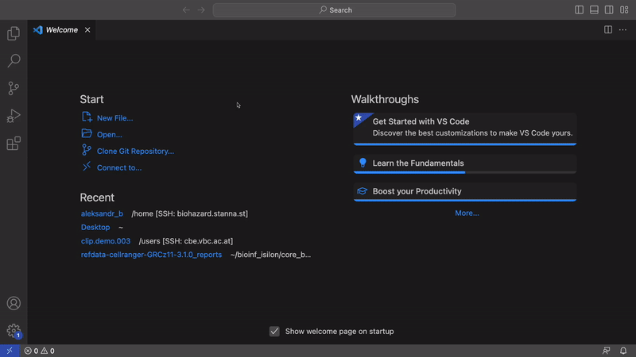

# Essentials

Here we will cover the very basic topics such as setting up the IDE, connecting to a server, basic Linux commands, and some tips on how to keep your project organized.

## Setting up the machine.

{width="678"}

There are different ways to access and work on an HPC cluster. For instance, macOS users have pre-installed Terminal on their systems. Another very popular solution - iTerm2. For Windows users, there are Windows Terminal or mobaXterm. But luckily it doesn't matter so much whether you have Windows or Mac, we recommend using VS Code, as a most simple and reliable tool.

The first step - [download the VS Code](https://code.visualstudio.com/), install, and run it. It will look something like this

{width="693"}

On the left panel you can see several tabs:

-   **Explorer** - allows you to navigate in your working space, and observe files and folders

-   **Search** - Search in documents

-   **Source control** - gives you control over a git repository. We will cover that later

-   **Run And Debug** - gives you the possibility to use automated debugging. We don't need it for now

-   **Extensions** - the main beauty of VS Code. Allows to install different modules that extend the capabilities of the IDE

-   **Profile** - allows you to connect your GitHub account and synchronize settings across different devices

-   **Settings** - settings and more ;)

If VS Code is new to you, we recommend having a look at the guides that VS Code offers to check: "Get Started with VS Code" and "Learn the Fundamentals". Also, the [official guides from Microsoft](https://code.visualstudio.com/docs/introvideos/basics) are really good.

Before we begin, we need to do a couple of adjustments to the VS Code, so that it works well with a cluster. This is **important**, please **don't skip** this step.

First, we will deactivate FileWatcher - this is a plugin that is constantly checking if files are changed in an open directory. This is convenient, but if you work in a folder that has many files it can load a CPU heavily. To do this follow these steps:

-   *Settings* \> *FileWatcher* \> *Add Pattern* \> add "\*"

Second, we will deactivate *TypeScript and JavaScript Language Features Support.* Sometimes it can load a CPU as well. Do the following steps:

-   *Extensions \> \@builtin TypeScript and JavaScript \> Disable \> Reload*

    

Now you need to install "*Remote - SSH*" plugging from the "*Extensions*" tab. Also, before connecting to the server, make sure that you have your account set up and Isilon storage mounted. To do that, contact BICU, we will help you. Ok, now you are ready to connect to the cluster. Follow these simple steps:

-   Click "*\>\<"* symbol in the left lower corner \> *Connect to Host* \> *+ Add New SSH Host...* Or select one that you have set up already.

-   Select the location where you want to store the config (the default is fine)

-   Then type in "ssh your_user_name\@machine_ip", where you_user_name is the name that you got from us and IP addresses:

    | Machine Name | Machine Linux Name  | IP address |
    |--------------|---------------------|------------|
    | Biodirt      | 011SV155.AD.CCRI.AT | 10.5.1.155 |
    | Biohazard    | 011SV157.AD.CCRI.AT | 10.5.1.157 |
    | Biowaste     | 011SV154.AD.CCRI.AT | 10.5.1.154 |

-   Enter your password (if it's the first time you log in to your account, then you have a generic password that you **must** change asap) and hit enter. You might be asked if you trust the connection, or if you want to

    

It doesn't look like much happened, but you are on the server. Now, let's go to the next step and have an overview of the structure of our cluster infrastructure and learn some basic Linux commands.
